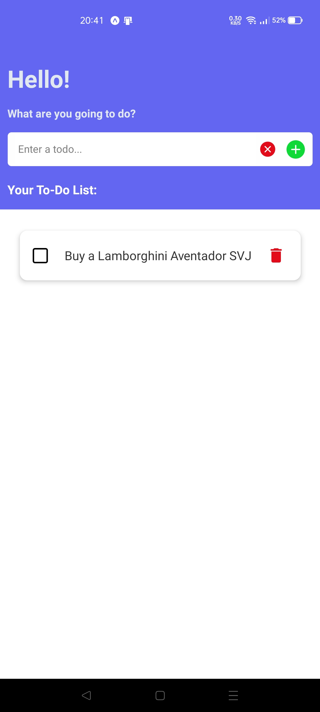

# To-Do List App (React Native)

This is a simple To-Do List app built with React Native. It allows you to perform CRUD (Create, Read, Update, Delete) operations on tasks, and uses AsyncStorage to persist the tasks across app restarts.

### Features:

- **Create**: Add new to-dos to the list.
- **Read**: View all your to-dos.
- **Update**: Mark to-dos as completed or pending.
- **Delete**: Remove to-dos from the list.
- **Persistent Storage**: The app uses **AsyncStorage** to save to-dos, so your data is preserved even after restarting the app.

### Tech Stack:

- **React Native**: Framework for building the app.
- **React**: Library for building the UI.
- **AsyncStorage**: Local storage for persisting the to-dos.
- **Icons**: `@expo/vector-icons` (Feather, MaterialCommunityIcons, AntDesign) for UI icons.

### Screenshots:

---
